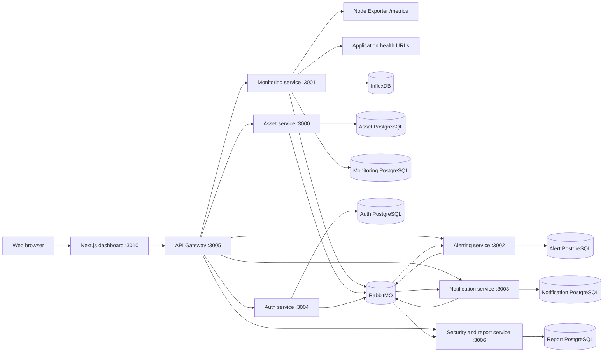

# Centralized Monitoring System

A self-hosted monitoring control plane for registering infrastructure assets,
collecting server metrics, checking application availability, evaluating alert
rules, notifying operators, preserving audit history, and generating operational
reports.

The V1 dashboard is designed to answer two questions quickly:

- What is currently unhealthy or requires attention?
- Which asset, metric, health check, or alert should an operator inspect next?

## Core Capabilities

- **Operational dashboard** with fleet-wide status, issue counts, latest metrics,
  and unacknowledged alerts.
- **Asset inventory** for servers, applications, and services across production,
  staging, and development environments.
- **Server monitoring** through Prometheus Node Exporter, including explicit
  hostname or IP selection, connection verification, collection status, and
  historical CPU, memory, disk, and network metrics.
- **Application health checks** with multiple full URLs per application,
  immediate checks, scheduled checks, latest status, response time, and retained
  history.
- **Metric rules** for CPU, memory, and disk thresholds with a continuous
  duration requirement to reduce transient false alarms.
- **Alert lifecycle management** covering triggered, acknowledged, automatically
  resolved, and closed states.
- **Email notifications** to system users or external recipients through SMTP.
- **User administration** with `ADMIN` and `OPERATOR` roles and an email
  invitation flow.
- **Audit logs** for configuration changes and operational actions emitted by
  the backend services.
- **Operational reports** generated from a versioned Word template and exported
  as PDF, both on demand and on a monthly schedule.

## Architecture



The browser communicates with backend services only through the API Gateway.
Each transactional service owns its PostgreSQL database. InfluxDB stores metric
time series, while RabbitMQ carries alert, notification, and audit events between
services.

## Main Workflows

### Server metrics

1. Register a `SERVER` asset with a hostname, an IP address, or both.
2. Create a monitoring target and select which address should be used when both
   values exist.
3. Verify the resolved scrape URL.
4. Enable collection after verification succeeds.
5. Review the latest and historical metrics or create threshold rules.

Changing the selected address or relevant target configuration invalidates the
previous verification. The target must be verified again before collection is
enabled.

### Application availability

1. Register an `APPLICATION` asset.
2. Add one or more full health URLs such as `/health`, `/ready`, or `/live`.
3. Let the scheduler check them or run **Check now** for an immediate recorded
   result.
4. Review availability, HTTP status, latency, and check history.

Health checks are intentionally independent from the asset endpoint. Updating an
application endpoint does not rewrite existing health-check URLs. The UI warns
when their origins differ.

### Alert processing

Metric and health-check evaluations publish alert events to RabbitMQ. The
Alerting service maintains the lifecycle and publishes notification events.
Operators can acknowledge active alerts; recovered alerts resolve automatically
and can then be closed without deleting their history.

### Asset lifecycle

Before an asset is activated, made inactive, or permanently deactivated, the UI
shows the affected monitoring target, health checks, metric rules, and active
alerts. Deactivation preserves operational history and resolves related active
alerts instead of hard-deleting records.

## Access Model

| Capability | `OPERATOR` | `ADMIN` |
| --- | --- | --- |
| View dashboard, assets, monitoring, health checks, rules, alerts, and reports | Yes | Yes |
| Acknowledge and close alerts | Yes | Yes |
| Configure assets, targets, health checks, and metric rules | No | Yes |
| Generate reports | No | Yes |
| View audit logs | No | Yes |
| Manage users and notification recipients | No | Yes |

Authentication uses short-lived access tokens and a rotating refresh token held
in an HTTP-only cookie. A pre-provisioned administrator invites additional users,
who set their password when accepting the invitation.

## Repository Layout

```text
.
|-- apps/
|   `-- web-dashboard/                 # Next.js operator dashboard
|-- services/
|   |-- api-gateway/                   # Authentication and API routing boundary
|   |-- asset-management-service/      # Asset inventory and lifecycle
|   |-- monitoring-service/            # Collection, health checks, and metric rules
|   |-- alerting-service/              # Alert state and lifecycle
|   |-- notification-service/          # SMTP delivery and recipients
|   |-- auth-service/                  # Login, sessions, invitations, and users
|   `-- security_report-service/       # Audit log and PDF report generation
`-- infrastructure/
    |-- compose.yaml                   # Local backend and data services
    `-- nginx/                         # Infrastructure health endpoint
```

## Technology Stack

- **Frontend:** Next.js 16, React 19, TypeScript, Tailwind CSS, TanStack Query,
  ECharts
- **Backend:** NestJS 11, TypeScript, Drizzle ORM
- **Data:** PostgreSQL 17, InfluxDB 2
- **Messaging:** RabbitMQ 3
- **Reporting:** Docxtemplater and LibreOffice
- **Runtime:** Node.js 22 and Docker Compose

## Service Ports

| Component | Default host port | Purpose |
| --- | ---: | --- |
| Web dashboard | `3010` | Browser UI |
| API Gateway | `3005` | Public application API under `/api` |
| Asset service | `3000` | Internal asset API |
| Monitoring service | `3001` | Internal collection and query API |
| Alerting service | `3002` | Internal alert API |
| Notification service | `3003` | Internal notification API |
| Auth service | `3004` | Internal authentication API |
| Security and report service | `3006` | Internal audit and report API |
| InfluxDB | `8086` | Metric time-series storage |
| RabbitMQ | `5672` | AMQP |
| RabbitMQ management | `15672` | Local management UI |

PostgreSQL host ports and the Nginx health port are configured in
`infrastructure/.env`.

## Prerequisites

- Node.js 22 and npm
- Docker Engine with Docker Compose
- LibreOffice when running `security_report-service` outside Docker
- SMTP credentials when testing email delivery
- A reachable Linux server or VM with Node Exporter for server-monitoring tests

## Configuration

Runtime secrets are intentionally excluded from Git. Configure these files
before starting the complete stack:

| File | Important values |
| --- | --- |
| `infrastructure/.env` | PostgreSQL users, passwords, database names and ports; InfluxDB; RabbitMQ; Nginx |
| `services/api-gateway/.env` | `FRONTEND_URL`, service URLs, `JWT_ACCESS_SECRET` |
| `services/auth-service/.env` | `DATABASE_URL`, JWT secret and expiry values, RabbitMQ |
| `services/monitoring-service/.env` | PostgreSQL, InfluxDB, Asset/Alerting URLs, RabbitMQ |
| `services/alerting-service/.env` | PostgreSQL and RabbitMQ |
| `services/notification-service/.env` | PostgreSQL, RabbitMQ, `SMTP_USER`, `SMTP_PASS` |
| `services/security_report-service/.env` | PostgreSQL, service URLs, RabbitMQ, LibreOffice path |
| `services/asset-management-service/.env` | PostgreSQL and RabbitMQ |
| `apps/web-dashboard/.env.local` | `NEXT_PUBLIC_API_GATEWAY_URL` |

For local development, the dashboard normally uses:

```dotenv
NEXT_PUBLIC_API_GATEWAY_URL=http://localhost:3005/api
```

The value of `JWT_ACCESS_SECRET` must match between the Auth service and API
Gateway. Do not commit real credentials or tokens.

The Compose environment must define every `${...}` variable referenced by
`infrastructure/compose.yaml`, including the database groups for `ASSET`,
`MONITORING`, `ALERTING`, `AUTH`, `NOTIFICATION`, and `SECURITY_REPORT`.

## Run Locally

The current development workflow runs the backend and data services with Docker
Compose and runs the web dashboard through Next.js.

### 1. Start data services

From the repository root:

```powershell
docker compose --env-file infrastructure/.env -f infrastructure/compose.yaml up -d `
  asset-db monitoring-db alerting-db auth-db notification-db security-report-db `
  influxdb rabbitmq
```

### 2. Install dependencies and run migrations

Every PostgreSQL-owning service has its own Drizzle migrations. Its
`DATABASE_URL` must point to the corresponding database port published on the
host.

```powershell
$services = @(
  "services/asset-management-service",
  "services/monitoring-service",
  "services/alerting-service",
  "services/auth-service",
  "services/notification-service",
  "services/security_report-service"
)

foreach ($service in $services) {
  npm --prefix $service ci
  npm --prefix $service run db:migrate
}
```

Migrations are currently run from the host. The production Docker stages omit
development dependencies, so `npm run db:migrate` is not available inside those
running containers.

### 3. Start the backend

```powershell
docker compose --env-file infrastructure/.env -f infrastructure/compose.yaml up --build -d
docker compose --env-file infrastructure/.env -f infrastructure/compose.yaml ps
```

Confirm that the API Gateway responds:

```powershell
curl.exe http://localhost:3005/api/metrics
```

### 4. Start the dashboard

```powershell
npm --prefix apps/web-dashboard ci
npm --prefix apps/web-dashboard run dev
```

Open [http://localhost:3010](http://localhost:3010). Sign in with a provisioned
account; the repository does not currently seed a default administrator.

### 5. Inspect logs or stop the stack

```powershell
docker compose --env-file infrastructure/.env -f infrastructure/compose.yaml logs -f
docker compose --env-file infrastructure/.env -f infrastructure/compose.yaml down
```

Do not add `-v` to `down` unless the PostgreSQL, InfluxDB, RabbitMQ, and report
volumes are intentionally being deleted.

## Connect a Linux Server

Install Node Exporter on the target server:

```bash
sudo apt update
sudo apt install prometheus-node-exporter -y
```

Enable and start it:

```bash
sudo systemctl enable prometheus-node-exporter
sudo systemctl restart prometheus-node-exporter
systemctl status prometheus-node-exporter
```

Verify it locally on the target:

```bash
curl http://localhost:9100/metrics
```

Allow TCP `9100` only from the machine or private network that runs the
Monitoring service. For UFW:

```bash
sudo ufw allow from MONITORING_SERVER_IP to any port 9100 proto tcp
```

Finally, verify the network path from the monitoring host:

```bash
curl http://SERVER_IP:9100/metrics
```

Register the server as an asset, create its Monitoring Target, verify the shown
scrape URL, and enable monitoring.

## Network and Security Notes

- Collection is **pull-based**. The Monitoring service must have a route to each
  Node Exporter or health-check endpoint; browser access alone is not enough.
- Keep Node Exporter on a trusted LAN, VPN, or private overlay network. Do not
  expose port `9100` directly to the public internet.
- Node Exporter reports host or VM metrics. Per-container CPU and memory require
  a container-aware collector such as cAdvisor, which is outside the V1 scope.
- Restrict public exposure to the dashboard and API Gateway. Internal service,
  database, InfluxDB, and RabbitMQ ports are published for local development and
  should be isolated in a production deployment.
- Set `FRONTEND_URL` to the exact deployed dashboard origin so credentialed CORS
  requests are accepted.
- Use HTTPS in front of the dashboard and Gateway before operating outside a
  trusted development network.

## Tests and Builds

Run checks from the package being changed:

```powershell
# Example backend service
npm --prefix services/monitoring-service test -- --runInBand
npm --prefix services/monitoring-service run build

# Frontend
npm --prefix apps/web-dashboard run lint
npm --prefix apps/web-dashboard run build
```

The repository has unit coverage for monitoring collection and retry cadence,
metric rule duration evaluation, health checks, alert processing, asset lifecycle
impact, invitations, notification delivery, audit events, and report generation.
Each NestJS service also contains an end-to-end test scaffold.

## Operational Semantics

- Monitoring Targets require successful verification before they can be enabled.
- Health Checks can monitor an endpoint that is already failing; they do not use
  the Monitoring Target verification gate.
- `Unknown` means no check result has been recorded yet. `Stale` means the latest
  result is older than the accepted interval.
- Archive operations retain historical records. They are not hard deletes.
- Failed collection attempts are paced by the configured scrape interval to
  prevent retry storms.
- Metric alerts trigger only after the threshold remains violated for the
  configured duration and resolve automatically after recovery.

## API Boundary

The browser-facing base URL is:

```text
http://localhost:3005/api
```

Primary route groups include:

```text
/api/auth
/api/users
/api/assets
/api/monitoring-targets
/api/health-check-targets
/api/metric-rules
/api/alerts
/api/notification-recipients
/api/audit-logs
/api/reports
/api/dashboard
/api/system/status
```

Backend service ports are implementation details for local development. New UI
calls should go through the API Gateway so authentication, authorization, CORS,
and service routing remain consistent.
